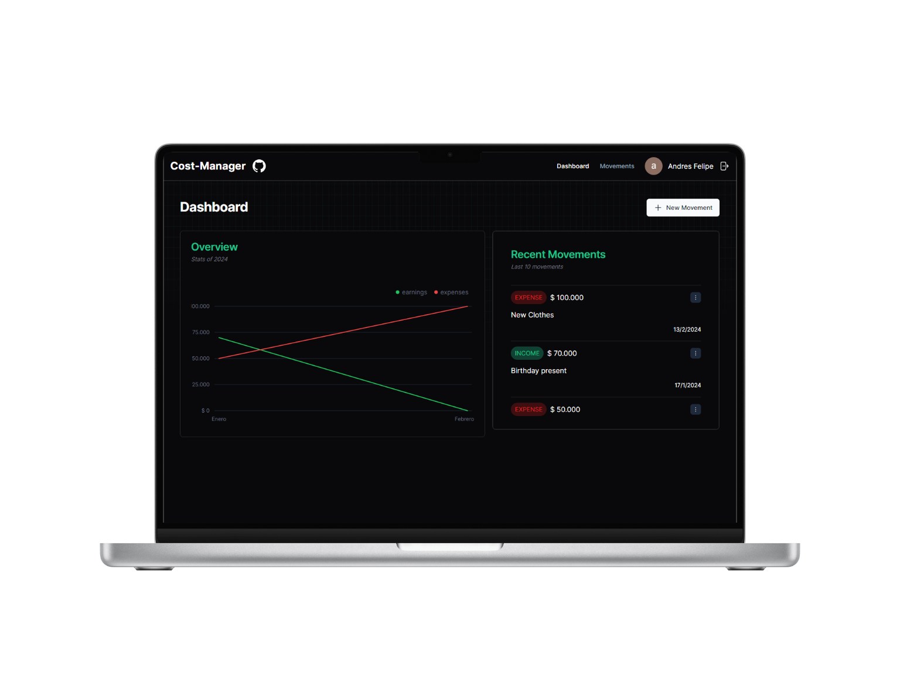

# Cost-Manager

Cost-Manager es una aplicación web construida con React, TypeScript, NextJS y Shadcn que te ayuda a gestionar tus finanzas personales. Con Cost-Manager, puedes realizar un seguimiento de tus ingresos y gastos, y obtener una visión clara de tu situación financiera.

## Características

- Registro y seguimiento de ingresos y gastos.
- Resumen financiero para obtener una visión general de tus finanzas.
- Interfaz de usuario amigable y fácil de usar.

## Cómo usarlo

Para usar Cost-Manager, sigue estos pasos:

1. Clona este repositorio en tu máquina local con el comando `git clone https://github.com/Laguilavo10/cost-manager.git`.
2. Navega al directorio del proyecto con `cd cost-manager`.
3. Instala las dependencias del proyecto con `npm install`.
4. Crea un archivo `.env` en la raíz del proyecto y configura las variables de entorno necesarias. Puedes usar el archivo `.env.example` como referencia.
5. Inicia la aplicación con `npm run dev`. La aplicación debería estar disponible en `http://localhost:3001`.

## Contribuir

Si estás interesado en contribuir se aceptan contribuciones de todo tipo, desde informes de errores hasta solicitudes de extracción.

## Licencia

Cost-Manager está licenciado bajo la [Licencia MIT](LICENSE).

## Contacto

Si tienes alguna pregunta o comentario, por favor abre un problema en este repositorio o ponte en contacto con [Laguilavo10](https://github.com/Laguilavo10) en GitHub.